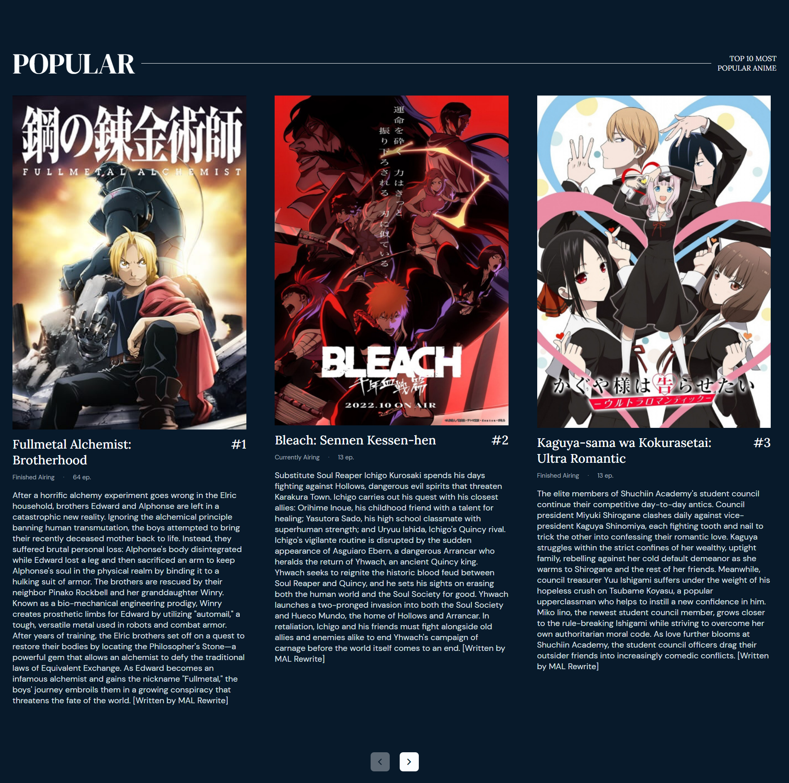

# Suikanime
On this static website you will find the anime that are currently on the air, the most popular anime and news related to anime and manga. All information comes from [MyAnimeList](https://myanimelist.net/ "The world's most active online anime and manga community and database.") and [AnmoSugoi](https://www.anmosugoi.com/ "The latest anime and manga news.").

## Technologies
This web page was made with the following technologies:
- HTML5
- CSS3
- JavaScript

## Sections
This web page contains 3 sections: **Seasonal**, **Popular** and **News**.

### Seasonal
#### In this section you will find the animes that are currently airing and what source they come from, for example, manga, light novel, original, etc. This information comes from [MyAnimeList](https://myanimelist.net/ "The world's most active online anime and manga community and database.").

### Popular
#### In this section you will find the 10 most popular anime. You will see how many chapters it has, if it has finished or is being broadcast, and its synopsis. This top 10 popular anime is from [MyAnimeList](https://myanimelist.net/ "The world's most active online anime and manga community and database.").

### News
#### In this section you will find news related to anime and manga. The news is from [AnmoSugoi](https://www.anmosugoi.com/ "The latest anime and manga news.").

